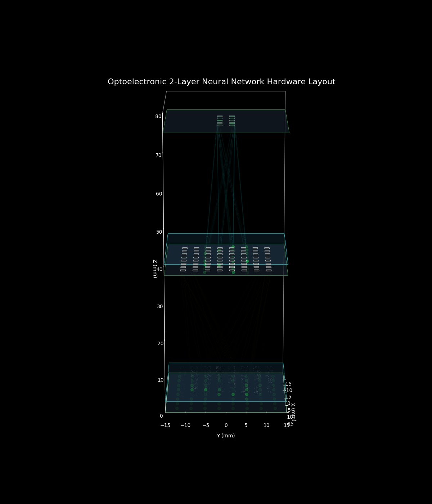
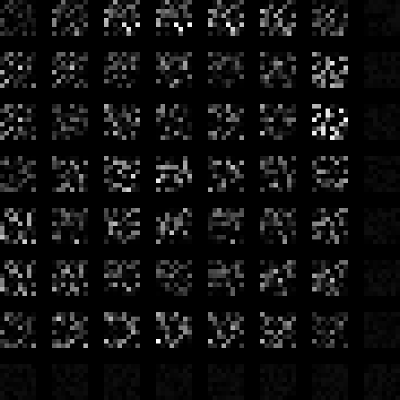
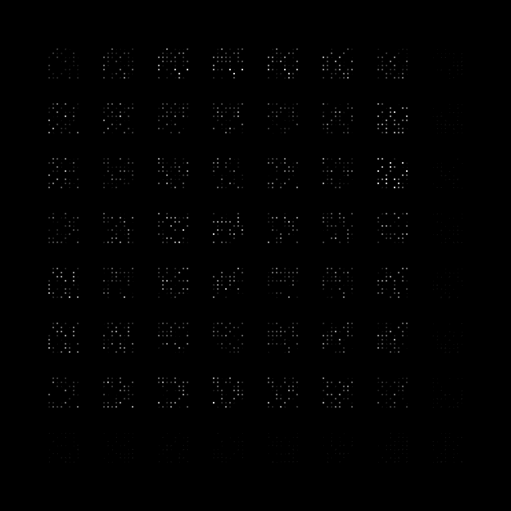
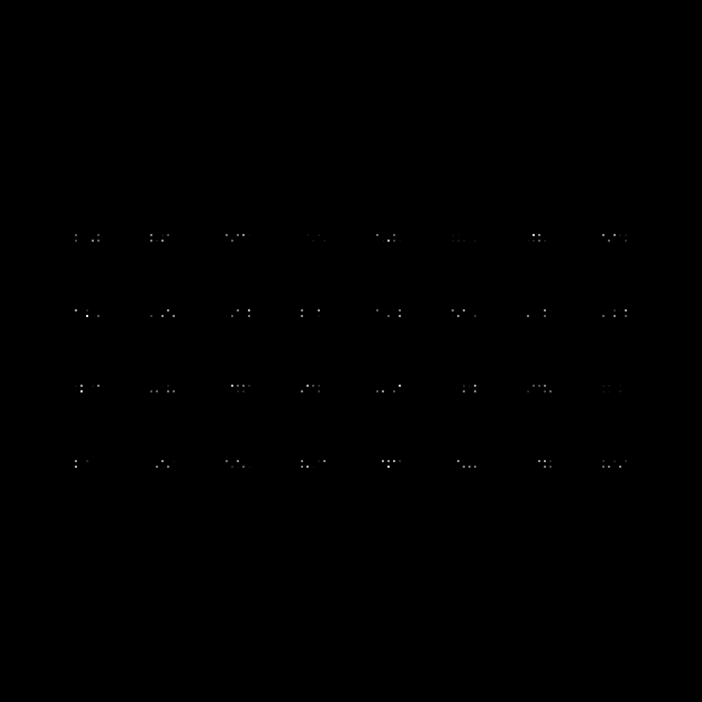
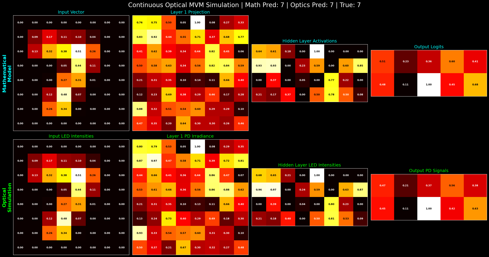
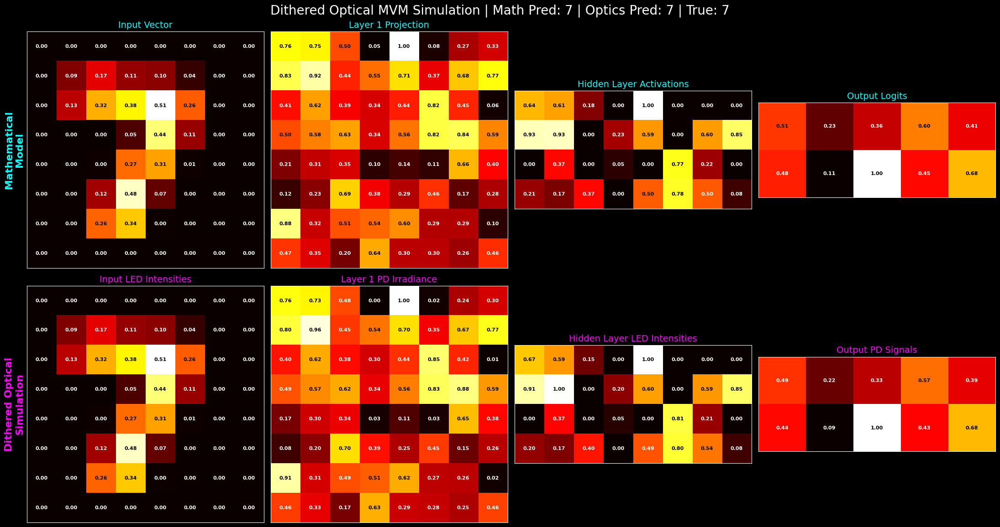

This project contains simulation code for optical neural network at IMSEAM

### 3D ray tracing visualization

---

### Photomask concept prior to dither 

---

### Dithered mask for first layer

---

### Dithered mask for second layer

---

### Comparison of neural network logits vs optical simulation

---

### Comparison of neural network logits vs simulation post dithering

---

Aayan Shah
Colby '28
Darthmouth '29
